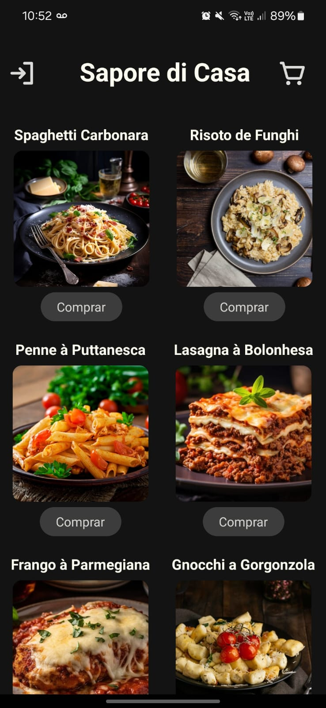
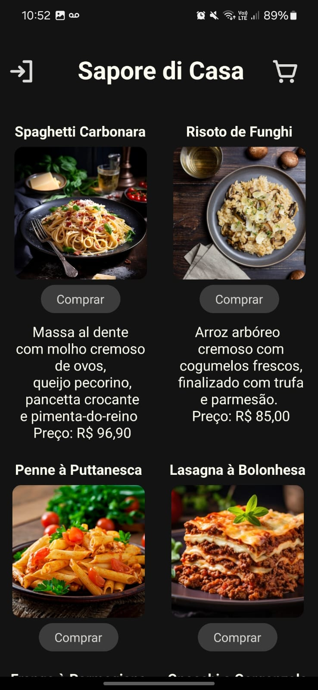
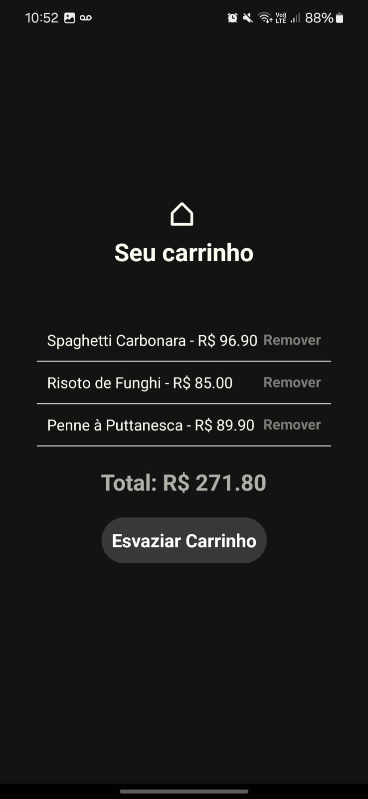
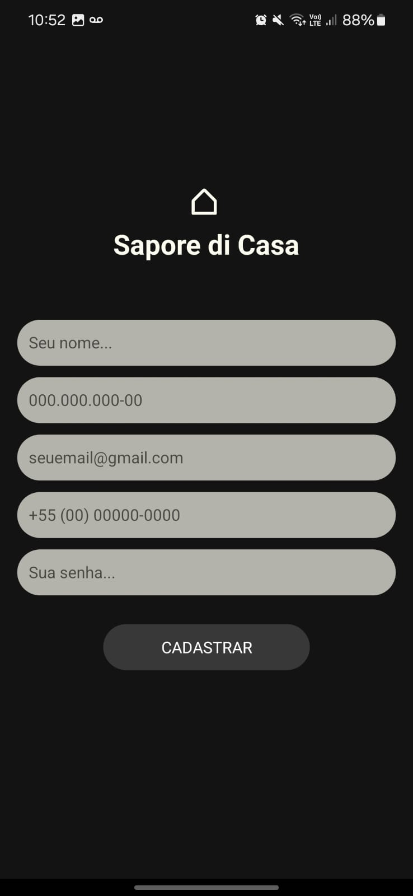

<h1 align="center"> Projeto cardápio digital </h1>

Projeto da matéria de Programação para Dispositivos Móveis que consiste em criar um cardápio digital para um restaurante.

## 🌐 Sobre o projeto

Foi criado um cardápio para um restaurante italiano chamado Sapore di Casa, utilizando o básico de react-native, na linguagem Javascript. A plataforma Expo foi utilizada para facilitar a emulação do aplicativo no celular e a plataforma escolhida foi o Android.

## 🎨 Tecnologias usadas
* React native
* Javascript 
* Expo

## 📸 Capturas de Tela

    
    
    
    

